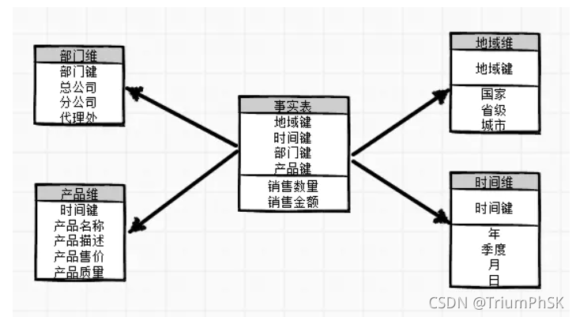
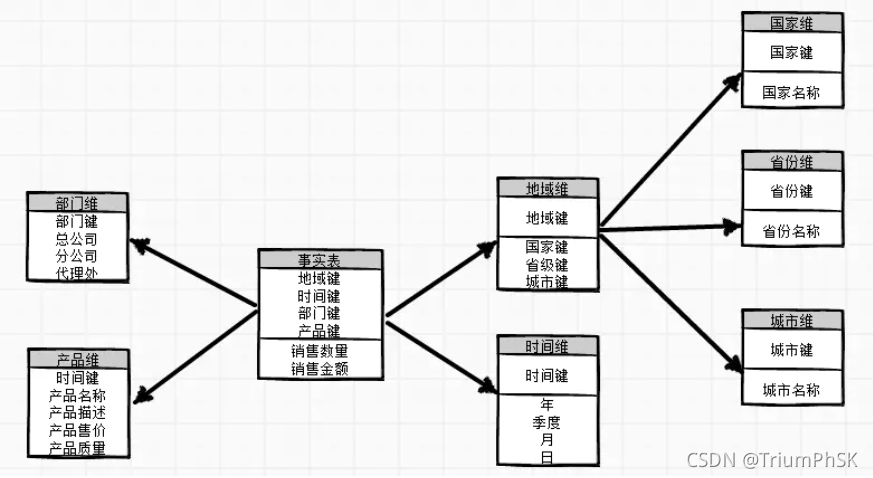

## 自我介绍
### 
Hello 大家好，我是卢真真，很高兴有机会能参加这场面试。
接下来，我来介绍一下我自己的以往工作经验，以及目前的技术栈。
### 
我是21年七月份正式加入Sanofi项目组的，在Sanofi项目大概有一年半左右的时间。工作是veeva Intergration 相关，我的日常是与我的上游系统MDM交互，MDM提供主数据相关的文件，我需要用到Informatica cloud 对主数据相关的job进行daily 的monitor任务，如果出现问题，会查看log日志，解决这些error信息。同时在这里我还会用到Control-M这个调度工具，MDM是将主数据文件放在对应的sharefloder 路径下，我每天也会check文件有没有成功从本地服务器放置informatica cloud这个服务器上。除此之外，我也会用到Oracle数据库，对数据进行查看。
我也会与我的下游也就是Veeva的客户,以及Veeva 赛动360的同事，会有工作往来。我还会对用户提出的需求进行分析，也会给用户阐述job的逻辑问题。除此之外，还会进行daily 的incident处理，以及SR处理。
除了Informatica cloud这个云上ETL工具之外，我也有使用过Informatica powercenter，参与开发过几个CR，了解一些power center的组件信息。

###
在今年年初，我开始接触了AWS，也参与了项目组内部的CICD敏捷开发项目，这个项目让我对云端的ETL DevOps有了一定的认识。在这个项目里我接触了AWS的IAM多账户管理，S3存储桶，在EC2如何搭建Airflow服务器、Jenkins服务器，如何使用cloud formation一键部署基础设施，使用Glue完成ETL job这些操作。我们的CICD主要是通过在Git上提交信息，或任何操作，触发Jenkins进行构建操作，完成一系列的流水线任务。我们这里主要是使用Jenkins一键部署Gluejob ，然后通过使用Airflow monitor job运行的状态。在整个项目中，我也对一些简单的shell命令有做到理解并使用，对于Python 目前还没有达到开发的能力，但目前是可以看懂大部分python代码的。以上是我的个人项目工作经验，以及设计到的相关技术栈信息

--（使用一个账户统一管理所有user信息，对于其他account 的具体service ，会在IAM里面配置相应的角色信息，通过Switch Role这个方法，完成用户访问其他账户的AWS资源）
- 虽然目前来说很多技术我没有做到理解很透彻，但我有学习和适应新技术的能力，并且愿意通过培训和实践来提高的自己的综合能力。 
- 
### 数据库和数据仓库的区别
- 数据库：面向事务，用于记录当前状态，数据结构是三范式。
- 数据仓库：面向分析，用于分析历史数据，数据结构是星型模型或雪花模型。 

## SQL
### 三范式
#### 第一范式（1NF）：
数据库中的每个列都是原子的，不可再分的。每个列的值都是不可再分的基本数据类型，如整数、字符串、日期等。
有主键，每个列都是原子的，不可再分的。如果有表里有一个字段是存放地址信息，存在省市区这样的概念，那就是不满足第一范式的。
该范式消除了重复的数据项，确保每个数据项的唯一性。
#### 第二范式（2NF）：
在满足1NF的基础上，数据库中的每个非主键列完全依赖于主键。换句话说，每个非主键列都与主键形成完整的依赖关系。
在满足1NF的基础上，数据库中的每个非主键列完全依赖于主键，也就是一个数据库表中只能存放一种信息。
比如说有一个学生表，里面存放学生ID，name，age,sex,还存放学生父亲ID，父亲姓名，这样就是不符合要求的
如果存在复合主键，则每个非主键列都必须依赖于所有主键列，而不仅仅依赖于部分主键列。
#### 第三范式（3NF）：
在满足2NF的基础上，数据库中的每个非主键列都不传递依赖于主键。换句话说，任何非主键列都不能依赖于其他非主键列。
在满足1NF，2NF的基础上，数据库中的每个非主键列都不传递依赖于主键。换句话说，任何非主键列都不能依赖于其他非主键列。
比如说，还是个学生表，，里面存放学生ID，name，age,sex,还有学校姓名，学校地址，学校联系电话，这样就不符合要求。学校姓名，学校地址，学校联系电话存在依赖关系。
该范式通过消除传递依赖关系，确保数据的非冗余性和一致性

## 数仓
### 数仓分层
- 原始数据层（ODS Operation Data Store）：数据源层是数据仓库的基础，存放从各个数据源中抽取的原始数据，通常不对数据进行任何处理，直接加载原始数据。
- 数据清洗层（DWD Data Warehouse Detail）：数据清洗层是数据仓库的核心，主要用于对原始数据进行清洗（去除空值，脏数据，超过极限范围的数据）。
- 数据集市层（DM Data Mart）：数据集市层是数据仓库的应用层，为各种统计报表提供数据支持。
- Snofi LDG - STG - PLD - Replica
- Ferro ODS - DWH - DM

### 为什么要对数仓进行分层
- 把复杂问题简单化
  - 从数据源层到数据集市层(ODS-->DM)，数据的处理逻辑逐层递进，每一层都是在上一层的基础上进行处理，使得整个数据处理过程变得简单。
  - 将一个复杂的任务分解为多个步骤来完成，每一层处理简单，易于理解和维护。
- 减少重复开发
  - 规范数据分层，通过中间层数据，能够减少重复开发，增加一次计算结果的复用性，提高数据开发效率。
- 隔离数据源
  - 通过数据分层，可以将数据源和数据处理逻辑隔离开来，使得数据源的变化不会影响到数据处理逻辑，提高数据处理的稳定性。


### 星型模型和雪花模型
- 星型模型：星型模型是一种简单的数据仓库模型，它由一个事实表和多个维度表组成，事实表和维度表之间通过主键和外键进行关联。

- 雪花模型：雪花模型是在星型模型的基础上，将维度表进一步细分为多个维度表，从而形成多个层次的维度表，这些维度表之间通过主键和外键进行关联。


### 缓慢变化维（Slowly Changing Dimension）
缓慢变化维是指在数据仓库中，用于存储维度数据的表，它的数据会随着时间的推移而发生变化，这种变化是缓慢的，而不是瞬间发生的。
- SCD Type 1（SCD1）：当维度数据变化时，直接覆盖原有数据，不保留历史记录。这种方法适用于不需要保留历史变化的情况，只关注当前状态的维度数据。新数据将完全替代旧数据。
- SCD Type 2（SCD2）：当维度数据发生变化时，保留原有记录，并添加新记录来反映变化。这样可以保留历史数据，以便进行时间分析和趋势分析。通常，在SCD2中，会添加一个生效日期和失效日期的列，用于标识每个版本的有效时间范围。
- SCD Type 3（SCD3）：在维度数据变化时，保留原有记录，并添加一些附加列来跟踪变化。通常，这些附加列用于存储先前的属性值，以便进行部分历史分析。SCD3相对于SCD2来说，对历史数据的保留更有限，只关注一些关键变化。

#### 假设我们有一个产品维度表，包含以下列：
- 产品ID（Product ID）
- 产品名称（Product Name）
- 产品类型（Product Type）
- 开始日期（start Date）
- 结束日期（end Date）

#### 设计逻辑如下：
- `初始状态`：在数据仓库中加载初始产品维度数据，每个产品有唯一的产品ID，产品名称，产品类型等属性，同时设置生效日期和失效日期为极大值'9999 12-31'。

- `变化发生`：当产品维度数据发生变化时，例如产品名称的修改，需要进行以下步骤： 
  - 在维度表中查找具有相同产品ID的最新记录，检查其结束日期是否为极大值。如果结束日期为极大值，将其设置为当前日期，表示该记录不再有效。
  - 创建一条新的记录，拷贝原有记录的产品ID，产品类型等属性，并更新产品名称为新值，同时设置开始日期为当前日期，结束日期为极大值。
  - 历史记录保留：通过保留历史记录，我们可以跟踪产品名称的变化。在维度表中，会存在多个具有相同产品ID的记录，但开始日期和结束日期不同。这样，我们可以根据需要进行历史数据查询和分析。

#### 举个例子：
假设有一个产品ID为 "P001" 的产品，在初始状态下，产品名称为 "Product A"，类型为 "Type 1"。后来，产品名称变更为 "Product A Updated"。根据SCD2的设计逻辑，我们会进行如下操作：
- 在维度表中查找产品ID为 "P001" 且失效日期为极大值的记录，假设该记录的生效日期为 "2022-01-01"。
- 将该记录的失效日期设置为 "2022-05-01"，表示该记录在 "2022-05-01" 不再有效。
- 创建一条新记录，拷贝产品ID、类型等属性，并将产品名称设置为 "Product A Updated"，生效日期设置为 "2022-05-01"，失效日期为极大值。
通过这种方式，我们可以在数据仓库中保留历史产品名称的变化记录，同时提供了当前有效的产品信息。这样，我们可以根据需要进行历史数据分析和趋势分析，同时保持维度数据的一致性和准确性。

### 事实表
事实表（Fact Table）是数据仓库中的一种关键表格，用于存储与业务事实和度量相关的数据。事实表包含了多个度量（Measure）列和与其关联的外键列，用于与维度表建立关联。
#### 以下是事实表的一些特点和设计要点：
- `存储度量数据`：事实表存储了与业务过程、事件或交易相关的数值型度量数据，例如销售金额、订单数量、库存量等。这些度量数据是可以被聚合和分析的关键指标。
- `外键关联维度表`：事实表通过外键与一个或多个维度表进行关联。这些外键通常是指向维度表中的主键列，用于连接事实表和维度表，以提供更多的上下文信息和分析维度。
- `粒度（Granularity）`：事实表的粒度是指每个事实记录所代表的业务事件或事实的详细程度。粒度决定了事实表的行数和存储的详细程度。例如，销售事实表可以以每个订单为粒度，或者更细粒度地以每个订单行为粒度。细粒度的数据可以提供更详细和具体的信息，而粗粒度的数据则更适合于总体趋势和高层次的分析
- `聚合层次`：事实表可以包含多个层次的度量数据，从较粗粒度的聚合数据到更细粒度的原始数据。这样可以支持不同层次的分析和报表需求，提供灵活性和性能优化。
- `时态数据`：某些情况下，事实表还可以存储时态数据，即描述时间的变化。例如，销售事实表可以包含销售日期列，以支持时间维度的分析和趋势分析。
- `可更新性`：事实表的可更新性是根据数据仓库设计和需求决定的。根据业务需要，某些事实表可能需要可更新性，以便对已有的事实数据进行修改和调整，以保持数据的准确性和实时性。而其他事实表可能被设计为只读的，用于存储历史数据或静态的度量指标，以支持分析和报表功能。

### 维度表
（Dimension Table）是数据仓库中的一种关键表格，用于存储与业务实体相关的描述性属性。维度表包含了维度属性列和与其关联的主键列，用于与事实表建立关联。
#### 以下是维度表的一些特点和设计要点：
- `存储描述性属性`：维度表存储与业务实体相关的描述性属性，例如产品、客户、时间等。这些属性用于提供上下文信息，帮助解释和分析事实表中的度量数据。
- `主键列`：维度表中的主键列是唯一标识每个维度实体的列。主键用于与事实表中的外键建立关联，实现维度和事实之间的关系。主键通常是一个稳定的标识符，不随时间或其他变化而改变。
- `描述性属性列`：维度表包含了描述性属性列，用于存储与维度实体相关的属性信息。例如，产品维度表可以包含产品名称、产品类型、制造商等属性列。这些属性提供了对维度实体的详细描述和分类。
- `层次结构`：维度表可以包含多个层次结构，用于提供维度数据的不同层次视图。例如，时间维度表可以包含年、季度、月份、日期等层次结构，以支持不同层次的时间分析和聚合。
- `可选属性和衍生属性`：维度表可以包含可选的属性列，用于提供更多的维度信息。此外，还可以包含衍生属性，这些属性是通过计算或转换从原始属性派生而来的。
- `缓慢变化维度处理`：维度表通常需要考虑缓慢变化维度（Slowly Changing Dimensions，SCD）的处理，以管理维度数据的变化。不同的SCD类型（如SCD1、SCD2）可以应用于维度表，以满足业务需求和数据历史追溯的要求。
- `可更新性`：维度表通常是一个只读的表，用于存储静态的描述性属性。在数据仓库中的ETL过程负责将源系统中的数据转换和加载到维度表中。
维度表的设计和建模需要考虑业务需求、数据分析的灵活性以及性能优化等因素。它提供了用于解释和分析事实表中度量数据的上下文信息，为数据仓库用户提供了丰富的维度分析能力。通过与事实表的关联，维度表支持复杂的查询、切片和钻取操作，从而支持业务决策和分析的需求。
- 切片 可以根据时间维度进行切片，仅获取某个特定时间段的数据。
- 钻取 例如时间维度可以有年、季度、月等不同层级。通过钻取操作，可以在不同层级之间切换，从而在不同粒度上查看数据，获得更详细或更总览的分析结果。
- 
### SQL优化查询语句：
- 确保使用合适的查询条件，使用 WHERE 子句限制结果集的大小。
- 避免使用通配符 "%" 开头的模糊查询，因为它会导致全表扫描。
- 避免在查询中频繁使用函数，特别是在 WHERE 子句中，因为它会导致索引失效。
- 尽量避免使用子查询，可以使用 JOIN 或其他关联方式来替代。
- 避免多次查询相同的数据，可以使用临时表或子查询来存储查询结果，以便后续复用。
- 避免使用 SELECT *
- 使用 UNION ALL 替代 UNION：UNION ALL 全部数据，UUNION 去掉重复数据
- 使用分页查询：limit，top

### SQL常用函数
- SUBSTR(string, start_position, length)
例如： SELECT SUBSTR('Hello, World!', 8, 5) AS result FROM dual; 返回结果World 
Oracle中字符串的索引是从1开始的。如果指定的起始位置超过了字符串的长度，SUBSTR函数将返回空字符串。如果长度超过了字符串可用的字符数，SUBSTR函数将截取到字符串的末尾。
- 开窗函数 
- 聚合函数 AVG()：计算平均值,SUM()：计算总和,COUNT()：计算行数或非空值的个数,MAX()：获取最大值,MIN()：获取最小值。
- 字符串函数 CONCAT()：拼接字符串;LENGTH()：获取字符串长度;SUBSTR()：截取子字符串;UPPER()：将字符串转换为大写;LOWER()：将字符串转换为小写;TRIM()：去除字符串首尾的空格或指定字符。
- 日期函数 SYSDATE：获取当前日期和时间;TO_CHAR()：将日期格式化为字符串;TO_DATE()：将字符串转换为日期;EXTRACT()：提取日期或时间部分（如年、月、日、小时、分钟等）。

### SQL索引
- 索引是一种用于提高数据库查询性能的数据结构，它可以加速数据的检索和过滤操作。
- 常见的索引类型，例如B树索引、唯一索引、聚集索引、非聚集索引和全文索引
- B树索引是最常见和最基本的索引类型。它适用于各种查询条件和数据类型，并且能够支持范围查询。B树索引可以加快数据的检索速度，特别是在大数据量的情况下。
- 索引通过创建一个数据结构，例如B树或哈希表，来存储索引键和对应的数据行的位置信息。当执行查询时，数据库引擎可以使用索引快速定位满足查询条件的数据行，而不需要逐行扫描整个表。例如，如果在一个员工表中有一个索引在"last_name"列上，当执行查询 SELECT * FROM employee WHERE last_name = 'Smith' 时，数据库引擎可以直接通过索引找到满足条件的数据行，大大提高了查询的速度。
- 唯一索引（Unique Index）：唯一索引要求被索引的列的值是唯一的。它可以用来确保数据的完整性，并且在进行唯一性检查时提供更高效的查询。唯一索引常用于对主键或者唯一性约束列进行索引，确保数据的唯一性。
- 聚集索引（Clustered Index）：聚集索引决定了表中数据的物理排序方式。它对于表的主键列非常有用，可以加速根据主键进行查询和排序操作。聚集索引将数据行物理上相邻存储，使得按照索引键进行的查询和排序操作非常高效。
  
 ### 查询计划
 - 使用 EXPLAIN PLAN 命令来生成查询计划。在执行查询之前，使用 EXPLAIN PLAN FOR 命令指定查询语句。然后，使用 SELECT * FROM TABLE(DBMS_XPLAN.DISPLAY); 命令来查看查询计划。
 - 通过查看查询计划，可以获得有关查询的关键信息，例如使用哪些索引、表之间的连接方式、执行的排序和聚合操作等。这些信息可以帮助了解查询的执行路径，以及是否可以对查询进行优化以提高性能。

### 游标是数据库中用于遍历和操作结果集的一种机制。它允许逐行访问查询结果，并提供了对结果集中数据的精细控制。
- 常见的使用场景包括需要对结果集进行逐行处理、需要在游标上进行滚动或定位、或者需要在多个查询之间共享数据等。
- 游标的生命周期：解释游标的生命周期，包括打开游标、获取数据、处理数据以及关闭游标的过程。
- cursor.execute("SELECT * FROM table_name")
- cursor.fetchall(),fetchall() 方法可以获取所有查询结果的行记录，会返回一个元组列表
- cursor.description ()获取查询结果的描述信息，包括列名等相关信息
- cursor.close()在完成数据库操作后，记得关闭游标和数据库连接。

### 触发器
- 对触发器的概念和基本原理有一定的理解。解释触发器是一种特殊对象，可以在数据库操作发生时自动触发执行相应的操作。
- 自动更新相关数据
有一个订单表和一个库存表。当有新订单插入订单表时，你可以创建一个触发器来更新库存表中对应商品的库存数量。这样，每次订单发生变化时，触发器会自动更新库存表，确保库存数量的准确性。

### 级联更新与级联删除
- 我对一端主键进行修改时，多端外键同时被修改
- 我对一端主键进行删除时，多端外键同时被删除


### 开窗函数 用PARTITION BY分组 ORDER BY排序
#### ROW_NUMBER()
#### ROW_NUMBER()1，2，3...
为结果集中的每一行分配一个唯一的整数值，常用于对结果集进行编号。可以处理重复数据
```sql
SELECT ROW_NUMBER() OVER (ORDER BY column_name) AS row_num, column_name
FROM table_name;
```
SELECT *
FROM (
    SELECT *,
           ROW_NUMBER() OVER (PARTITION BY product_name,Amount ORDER BY insert_date) AS row_num
    FROM Product
) AS temp
WHERE row_num > 1;  删除重复数据

#### RANK()
#### RANK()1,1,3..
根据指定的排序顺序，为结果集中的每一行分配一个排名，如果有相同值，则会跳过下一个排名
```sql
SELECT RANK() OVER (ORDER BY column_name) AS rank_num, column_name
FROM table_name;
```
#### DENSE_RANK() 
#### DENSE_RANK() 1,1,2..
根据指定的排序顺序，为结果集中的每一行分配一个密集排名，如果有相同值，则会跳过下一个排名，但不会留下空缺。
```sql
SELECT DENSE_RANK() OVER (ORDER BY column_name) AS dense_rank_num, column_name
FROM table_name;
#### 
```
#### SUM() 累加
```sql
SELECT column_name, SUM(column_name) OVER (PARTITION BY partition_column) AS total_sum
FROM table_name;
```
SELECT product_name, sale_date, sale_amount,
SUM(sale_amount) OVER (PARTITION BY product_name ORDER BY sale_date) AS cumulative_sales
FROM sales; 计算累计销售额

#### AVG()
```sql
SELECT column_name, AVG(column_name) OVER (PARTITION BY partition_column) AS average_value
FROM table_name;
```
### 计算每个员工的销售额，并显示该员工的销售额与部门平均销售额的差异。
```sql
select employee_id,sale_amount,
avg(sale_amount) over (partition by department_id) as avg_amount,
sale_amount - avg(sale_amount) over (partition by department_id) as diff_amount
from sales2
```

## AWS
### 跨账号IAM角色访问
- 中央身份账户体系
- 建立中央身份账户，集中为组织建立用户、密码以及访问密钥，进行统一管理用户。

#### A账户
- 创建一个IAM用户，zhangsan
- 为用户zhangsan配置允许切换到B中角色的权限
```json
{
  "Version": "2012-10-17",
  "Statement": [
    {
      "Effect": "Allow",
      "Action": "sts:AssumeRole",
      "Resource": "arn:aws:iam::B-ACCOUNT-ID:role/test-role"
    }
  ]
}
```
#### B账户
- 创建一个角色test-role，受信任实体为其他aws账户，指定A账户的accountid
- 权限策略给上S3存储桶的权限AmazonS3FullAccess
- 信任关系里编辑AssumeRole,可以将principal设置为A的root
```json
{
  "Version": "2012-10-17",
  "Statement": [
    {
      "Effect": "Allow",
      "Principal": {
        "AWS": "arn:aws:iam::A-ACCOUNT-ID:root"
      },
      "Action": "sts:AssumeRole"
    }
  ]
}

Switch role 的链接信息，存放在B账户的test-role的摘要页面里，点击进来就完成了将A账户用户访问B账户S3存储桶

```
- 配置存储桶策略
```json
{
  "Version": "2012-10-17",
  "Statement": [
    {
      "Effect": "Allow",
      "Principal": {
        "AWS": "arn:aws:iam::A-ACCOUNT-ID:root"
      },
      "Action": "s3:*",
      "Resource": [
          "arn:aws:s3:::xxxxxx",
          "arn:aws:s3:::xxxxxx/*"
      ]
    }
  ]
}
```

## Informatica 相关
### 优化
- 在源和目标数据库中创建合适的索引，以加速数据的读取和写入操作。
- 使用数据库统计信息，确保查询优化器能够生成最佳的查询执行计划。
- 将mapping的目标分解，保留一个目标
- 在join、agg之前排序器转换组件
- 使用filter组件时，若过滤条件复杂，可以先使用exporession组件生成类似条件字段，然后在filter组件使用该字段过滤可大大提高性能

### joiner和lookup转换组件的区别
#### Joiner 转换：
- Joiner 转换用于将两个或多个输入数据流连接在一起，基于指定的连接条件将它们合并成一个输出数据流。
- Joiner 转换可以实现不同数据源之间的连接操作，类似于 SQL 中的 JOIN 操作。
- Joiner 转换适用于连接那些在结构上相互独立的数据流，通常需要在转换之前对输入数据进行排序操作。
- Joiner 转换支持多种连接类型，如等值连接、外连接等。
#### Lookup 转换：
- Lookup 转换用于在源数据集中查找匹配条件的记录，并将查找到的数据添加到目标数据流中。
- Lookup 转换通常用于根据某个键值在查找表或参考表中查找相应的数据，并将查找到的数据合并到主数据流中。
- Lookup 转换适用于需要从参考表或查找表中获取额外信息的情况，类似于 SQL 中的 JOIN 操作。
- Lookup 转换支持不同的查找模式，如查询模式、更新模式、插入/更新模式等，以满足不同的数据需求。
因此，Joiner 转换主要用于连接不同数据源之间的数据，而 Lookup 转换主要用于在源数据中查找参考表或查找表的匹配数据。它们的使用场景和功能略有不同，根据实际需求选择合适的转换组件进行数据集成和转换操作。
#### Powercenter组件信息
- 源组件：首先，你需要使用适当的源组件连接到数据源，如关系数据库、文件或应用程序接口等。
- Filter（过滤器）组件：如果你需要过滤数据集，可以在源组件之后使用Filter组件。通过指定条件表达式，你可以过滤掉不需要的数据行，只保留满足条件的数据。
- Expression（表达式）组件：在Filter组件之后，你可以使用Expression组件对数据进行转换和计算。这可以包括使用内置函数、运算符和条件表达式来修改数据、计算衍生字段或进行数据格式转换等。
- Sorter（排序器）组件：如果需要按照特定顺序处理数据，可以在Expression组件之后使用Sorter组件。通过指定排序规则，Sorter组件将数据按照指定的顺序进行排序，以便后续的处理步骤能够按照需要进行操作。
- Aggregator（聚合器）组件：如果需要对数据进行聚合操作，可以在Expression或Sorter组件之后使用Aggregator组件。通过指定分组键和聚合函数，Aggregator组件将数据按照指定的分组进行聚合，生成汇总结果。
- Joiner（联接）组件：如果需要将多个数据源的数据进行联接操作，可以在前面的组件之后使用Joiner组件。通过指定连接条件，Joiner组件可以将不同数据源中的相关数据连接在一起，生成联接后的结果。
- Lookup（查找）组件：如果需要在一个数据流中查找另一个数据流中的匹配记录，可以在前面的组件之后使用Lookup组件。通过指定查找条件和查找表，Lookup组件可以在数据流中查找匹配的记录，并将其加入到输出流中。
- Router（路由器）组件：Router组件根据指定的条件将数据路由到不同的输出流。它根据条件表达式的结果将数据行发送到符合条件的输出端口。Router组件常用于根据数据的某些属性进行分类、分流或筛选操作。
- Update Strategy（更新策略）组件：Update Strategy组件用于确定数据在目标系统中的操作类型，例如插入（Insert）、更新（Update）、删除（Delete）或拒绝（Reject）。你可以在Update Strategy组件中定义条件和规则来决定每条数据的操作类型。它常用于数据仓库和数据集成任务中，用于管理数据的变更操作。
- Sequence Generator（序列生成器）组件：Sequence Generator组件用于生成连续的唯一序列号。它可以生成不同类型的序列，如整数序列、日期序列等。Sequence Generator组件常用于生成唯一的主键或标识符，以确保数据的唯一性和一致性。
  
## Shell 命令
- `ls`：列出目录内容。
示例：ls -l，显示详细信息；ls -a，显示隐藏文件。
- `cd`：切换当前工作目录。
示例：cd /path/to/directory，切换到指定目录；cd ..，切换到上级目录。
- 'pwd'打印当前路径
- `mkdir`：创建新目录。
示例：mkdir new_directory，创建名为 "new_directory" 的新目录。
- `cp`：复制文件或目录。
示例：cp file1.txt file2.txt，将 "file1.txt" 复制为 "file2.txt"。
- `mv`：移动文件或目录，也可用于重命名。
示例：mv file1.txt /path/to/directory/file2.txt，将 "file1.txt" 移动到指定目录。
- `rm`：删除文件或目录。
示例：rm file.txt，删除名为 "file.txt" 的文件；rm -r directory，删除名为 "directory" 的目录。
- `touch`：创建空文件或修改文件时间戳。
示例：touch new_file.txt，创建名为 "new_file.txt" 的空文件。
- `cat`：查看文件内容。
示例：cat file.txt，显示 "file.txt" 文件的内容。
- `chmod`：修改文件或目录的权限。
示例：chmod +x script.sh，给脚本 "script.sh" 添加执行权限
- `grep`：在文件中搜索指定的模式。
示例：grep "pattern" file.txt，搜索文件中匹配指定模式的行。
- `vim`，`nano`文本编译器
示例： `vim`进入编辑'i',退出ESC+ ：wq(保存退出)（!q 强制退出）
- 'file' ： 用来获取文件类型，查属性
- 'less','more'：用来看文本文件的全文
- 'where' ：查看位置信息
- `top`：实时监控系统的进程和资源使用情况。
示例：top
- `ps`：查看当前系统中运行的进程。
示例：ps aux
- `free`：显示系统的内存使用情况。
示例：free -h


## 业务
### 1. Veeva CRM概念
Veeva CRM是为生命科学行业的销售、市场营销和客户服务团队而设计，是为了帮助企业与Account（例如医生、医院、药店等）建立和维护良好的关系。

### 2. Veeva CRM主数据
-客户主数据：在Veeva CRM中，客户主数据是指Account（HCO，HCP）相关的关键信息。这些信息可能包括个人资料、联系方式、专业背景、特定领域的专长、科室信息等。Veeva CRM提供功能和工具，用于记录、管理和维护客户主数据，并确保数据的准确性和完整性。
-产品主数据：产品主数据涵盖了企业所提供的各种药品相关信息。这些信息包括产品名称、描述、规格、剂量、适应症、包装等。
-销售团队主数据：Veeva CRM还管理与销售团队相关的主数据，包括MR、DM、DSM等的信息。这些数据可以包括个人资料、职位、所辖区域、目标客户等。通过维护销售团队主数据，Veeva CRM可以帮助企业对销售团队进行管理、分配资源和跟踪业绩。

### DCR
对于主数据信息存在变更，代表会通过DCR在这里申请新增，修改，新增加入区域，从区域移除等操作的载体，主要用于审批和修改留痕。

### TSF
每个代表可以设置自己的目标医生，目标医生与代表的岗位关联，当代表离职下一个人会继承这个岗位时，会继承之前代表所选的目标医生分级。
存在版本控制，可以配置当月维护下月

### 拜访、协防：Rep拜访医生，传递药品信息
- 1. 在CRM填写拜访报告
- 拜访时间、客户、产品以及关键信息（医保内、起效快…）、客户反馈
- 2. 行为KPI的考核，销售行为的数据基础

### 区域外时间:(TOT)
记录休假信息，培训信息等，这些事件不会记录在工作时长里

### MCCP多渠道周期计划：一个周期内多个渠道行为与指标设定、追踪
- 面对面拜访，远程拜访，科室会…
- 会按照医生级别划分不同的拜访次数
 ### 窗口期
- 统一设置业务的开放窗口期
- 可总览窗口期设置以及依赖关系
- 窗口期可定期或者手动开启


